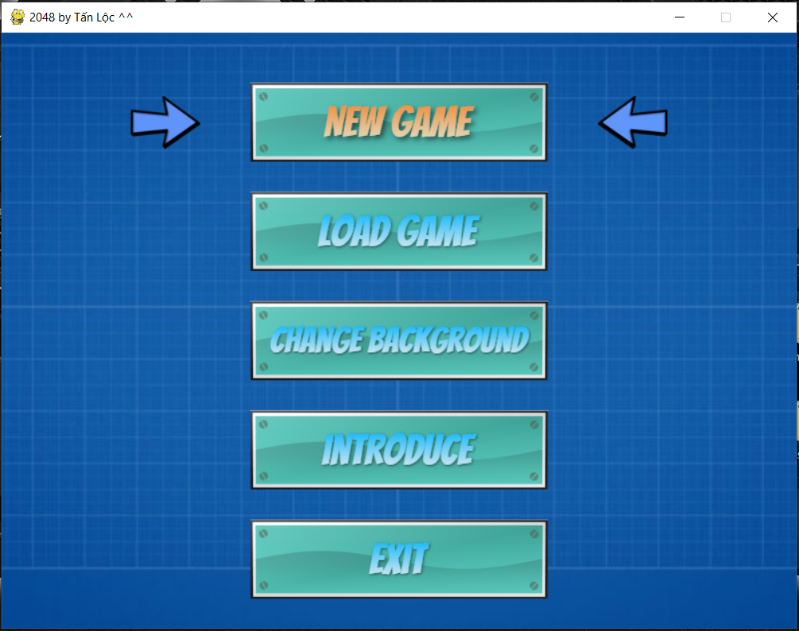
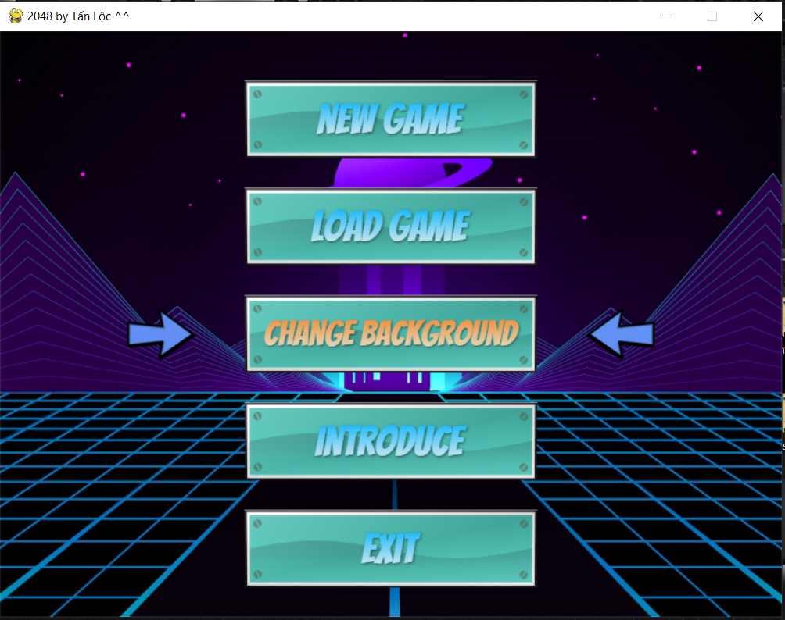
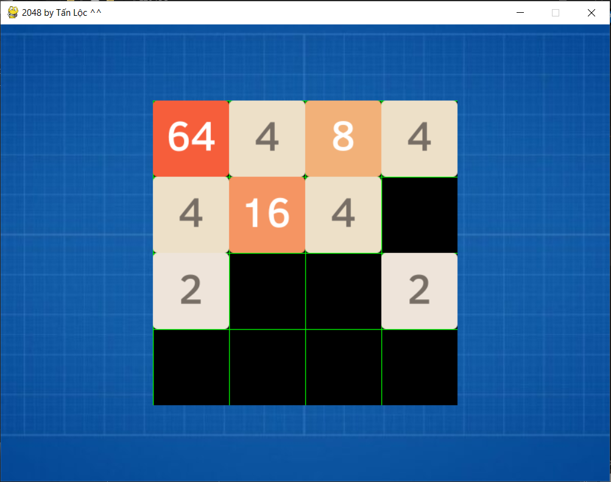

# Game 2048

This is my first game developed by python

I used pygame library

All creative implementation ideas are built by me

* The pygame functions consults from:

https://codelearn.io/sharing/lap-trinh-game-co-ban-voi-pygame

https://codelearn.io/sharing/lap-trinh-game-co-ban-voi-pygame-p2

* Screeshots

  
   
  

